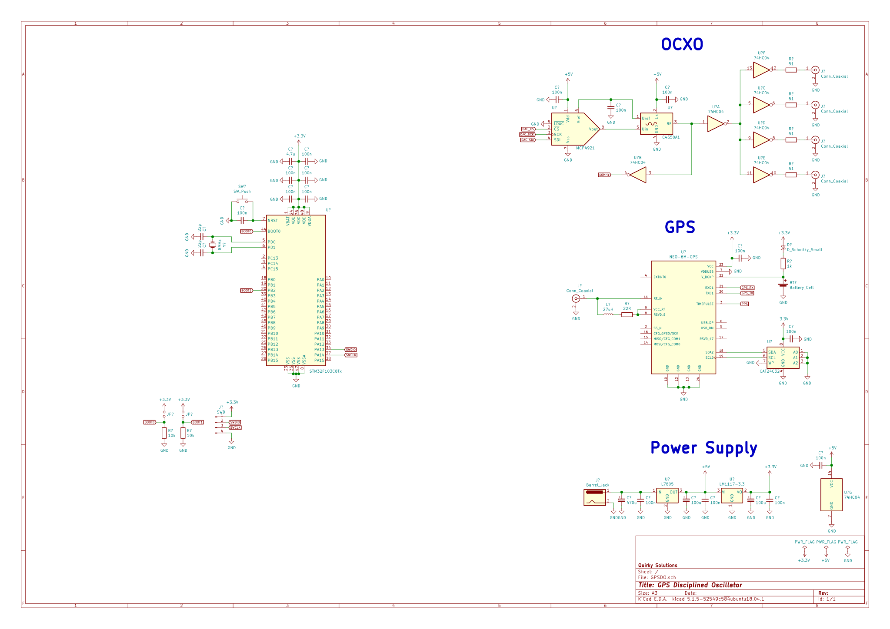

# GPS Disciplined Oscillator

This is a GPS disciplined oscillator with intended use as a high stability clock signal reference. The core componets include:
* Vectron C4550 10 MHz voltage controlled OCXO
* uBlox NEO-6M GPS module
* STM32F103C8

## Schematic

